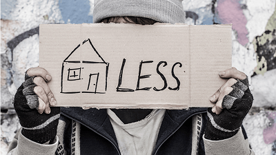

# US Homelessness Population

### Introduction: 
>More than thousands of people are sleeping on streets and homeless shelters in the United States. The purpose of this project is to explore the homeless population for each state in the US. The homeless population dataset gathered include population count by state in 2010 through 2019. The project includes visualizations showing the severity of homelessness in the entire country over the years.

### Project Description:
This project explores the homeless population for each state in the US. The final datasets generated after performing Web-scraping and ETL is loaded to its final destination, SQL database. The following list shows a general breakdown of the different tasks completed for this project: 
>   * 1: Data collection/extraction and web-scraping
>   * 2: Data exploration, cleanup, and transformation
>   * 3: Data loading into SQL
>   * 4: Visualizations (D3 and Leaflet)
>   * 5: Html web page 

### Purpose: 
The purpose of this project is to explore the homeless population by state datasets from various sources. The collection of datasets is cleaned and transformed in order to make it usable for data analysis and visualizations.  

### Scope: 
* Annual homeless population count by state.
* The collected data includes year 2010 through 2019.

### Methods used: 
* Web-scraping
* ETL
* Regular Expression(RegEx) 
* Javascript
* HTML/CSS

### Website Link:
https://mengye22.github.io/US-homelessness/master/templates/index.html 
* (Needs api key to dispaly the map, file on Mengye/webPage/static/js/config.js and Kay/static/config.js)

### Dataset Sources: 
>* Homeless Shelter Directory: https://www.homelessshelterdirectory.org/ 
>* US Department of Housing and Urban Development: https://www.hud.gov/2019-point-in-time-estimates-of-homelessness-in-US

### Conclusion: 
>Based on the quantitative datasets gathered, the overall total homeless population in the United States slightly decreased from year 2010 to 2019 by approximately 11 percent. Despite the decrease in total number, homelessness continues to be a significant issue in some states. California remains as the state with the most homeless population from 2010 to 2019 followed by New York, Texas and Florida. The overall homeless population in California shows a significant increase over a decade. Wyoming remains as the state with the lowest homeless population. Homelessness is concentrated in major cities on the West Coast and the Northeast. Almost half (47 percent) of all unsheltered homeless people are found in the State of California, about four times as high as California’s share of the overall U.S. population. Certain subpopulations are significantly represented within homelessness, such as Individuals. 70% of people experiencing homelessness are individuals who are living on their own or in the company of other adults. The remainder (30 percent) are people in families with children. Unsheltered. Far too many people in America sleep outside and in other locations not meant for human habitation. This group includes more than 200,000 people (37 percent of the overall population). Among individuals experiencing homelessness, the numbers are more dire—1 in 2 are unsheltered.
